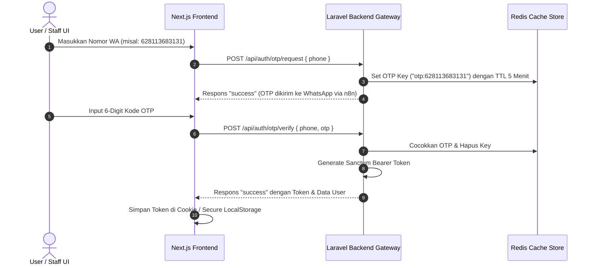

# 🖥️ LUNDRY.id — Frontend Integration Guide & Single Source of Truth
> **Panduan Integrasi API & Kontrak Data Premium untuk Frontend Developer (Next.js Monorepo)**

Dokumen ini adalah **Single Source of Truth (Sumber Kebenaran Data Tunggal)** bagi tim frontend Next.js monorepo (POS Kasir, Owner Dashboard, Mitra Drop Point, Aplikasi Kurir, dan Web Tracking Pelanggan) untuk berintegrasi secara mulus, aman, dan berkinerja tinggi dengan **LUNDRY.id Backend Gateway**.

---

## 🏛️ 1. Protokol Dasar & Struktur JSON Envelope

Semua komunikasi data antara Frontend (FE) dan Backend (BE) wajib tunduk pada aturan amplop terpadu ini demi efisiensi *state management* (seperti RTK Query, SWR, atau React Query):

### A. Base URL & Headers
*   **Production API**: `https://api.lundry.id/api`
*   **Development API (Local)**: `http://127.0.0.1:8000/api`
*   **Header Wajib**:
    ```http
    Accept: application/json
    Content-Type: application/json
    ```
*   **Header Autentikasi** (kecuali router `/auth/*`):
    ```http
    Authorization: Bearer <token_kamu>
    ```

### B. Standard Response Wrapper
Setiap respons JSON dari backend dibungkus dalam amplop terpadu:

#### 🟢 Respons Sukses (Success Envelope)
*   **HTTP Status**: `200 OK` (mengambil/memperbarui data) atau `201 Created` (membuat data baru).
*   **Format JSON**:
```json
{
  "status": "success",
  "message": "Pesan deskriptif aksi sukses (opsional).",
  "data": { ... } // Objek tunggal atau Array data utama
}
```

#### 🔴 Respons Gagal (Error Envelope)
*   **HTTP Status**: `400` (Bad Request), `401` (Unauthorized), `403` (Forbidden), `404` (Not Found), `422` (Validation Fail), `500` (Server Error).
*   **Format JSON**:
```json
{
  "status": "error",
  "code": 422, // Menyalin ulang status code HTTP
  "message": "Deskripsi kesalahan umum.",
  "errors": { ... } // Detail field yang salah (khusus status 422, opsional)
}
```

---

## 🔑 2. Sistem Autentikasi OTP WhatsApp (Passwordless)

Autentikasi LUNDRY.id menggunakan nomor telepon WhatsApp aktif tanpa password konvensional.



### 📝 Axios Interceptor Boilerplate (Next.js Monorepo):
Gunakan interceptor premium ini untuk mengotomatiskan injeksi Bearer Token dan menangani token kedaluwarsa secara global:

```typescript
import axios from 'axios';

const api = axios.create({
  baseURL: process.env.NEXT_PUBLIC_API_URL || 'http://127.0.0.1:8000/api',
  headers: {
    'Accept': 'application/json',
    'Content-Type': 'application/json',
  },
});

// Request Interceptor: Otomatis menyematkan Bearer Token
api.interceptors.request.use((config) => {
  const token = typeof window !== 'undefined' ? localStorage.getItem('token') : null;
  if (token && config.headers) {
    config.headers.Authorization = `Bearer ${token}`;
  }
  return config;
}, (error) => {
  return Promise.reject(error);
});

// Response Interceptor: Tangani 401 Unauthorized (Token Hangus)
api.interceptors.response.use(
  (response) => response.data,
  (error) => {
    if (error.response && error.response.status === 401) {
      if (typeof window !== 'undefined') {
        localStorage.removeItem('token');
        window.location.href = '/auth/login'; // Tendang paksa ke login
      }
    }
    return Promise.reject(error.response?.data || error);
  }
);

export default api;
```

---

## 🧬 3. Kamus Tipe Data TypeScript (TypeScript Interfaces)

Salin antarmuka (interface) di bawah ini langsung ke file tipe monorepo Next.js Anda (misal: `@/types/index.ts`) demi keutuhan tipe data:

```typescript
// ==================== ENUMS & ENUM-LIKE TYPES ====================
export type MembershipTier = 'regular' | 'bronze' | 'silver' | 'gold';
export type OrderStatus = 'received' | 'processing' | 'ready_for_pickup' | 'delivered' | 'voided';
export type PaymentMethod = 'cash' | 'qris' | 'bank_transfer' | 'coin' | 'prepaid_balance' | 'split';
export type PaymentStatus = 'pending' | 'success' | 'failed';
export type BagStatus = 'received' | 'sorting' | 'washing' | 'drying' | 'ironing' | 'transit_to_outlet' | 'received_at_outlet' | 'transit_to_customer' | 'delivered';

// ==================== DATA MODELS ====================
export interface User {
  id: string; // Format ULID (contoh: 01krxqm6t4cbt4p62p7qd7h2p7)
  outlet_id: string | null;
  name: string;
  email: string;
  phone: string;
  role: 'owner' | 'manager' | 'cashier' | 'courier' | 'customer';
  is_active: boolean;
  created_at: string;
}

export interface Customer {
  id: string;
  outlet_id: string;
  name: string;
  phone: string;
  address: string | null;
  wash_preference: string | null;
  membership_tier: MembershipTier;
  prepaid_balance: number; // Disimpan sebagai float desimal
  coin_balance: number;    // Jumlah saldo koin loyalitas
  referral_code: string;
  created_at: string;
}

export interface QrBag {
  id: string;
  order_id: string;
  qr_code_string: string; // Format: LND-BAG-<order_no>-<index>-<hash>
  bag_index: number;
  current_status: BagStatus;
  created_at: string;
  updated_at: string;
}

export interface OrderItem {
  id: string;
  order_id: string;
  service_name: string;
  price_per_unit: number;
  quantity: number; // Berat (kg) atau kuantitas (satuan)
  subtotal: number;
  created_at: string;
}

export interface Order {
  id: string;
  outlet_id: string;
  customer_id: string;
  drop_point_id: string | null;
  order_number: string; // Format: LND-YYYYMMDD-XXXX
  status: OrderStatus;
  estimated_weight: number;
  final_weight: number | null;
  total_amount: number;
  discount_amount: number;
  final_amount: number;
  pickup_delivery_method: 'self' | 'courier';
  estimated_completion_at: string;
  notes: string | null;
  created_at: string;
  items?: OrderItem[];
  qr_bags?: QrBag[];
  customer?: Customer;
}

export interface Payment {
  id: string;
  order_id: string;
  payment_method: PaymentMethod;
  amount: number;
  status: PaymentStatus;
  transaction_reference: string | null;
  created_at: string;
  order?: Order;
}

export interface TrackingHistoryLog {
  id: string;
  qr_bag_id: string;
  scanned_by: string;
  status_from: BagStatus;
  status_to: BagStatus;
  latitude: string; // Koordinat desimal dari server
  longitude: string;
  created_at: string;
  qr_bag: {
    qr_code_string: string;
    bag_index: number;
  };
  scanned_by_user: {
    name: string;
    role: string;
  };
}

// ==================== API REQUEST PAYLOADS ====================
export interface OtpRequestPayload {
  phone: string; // Contoh: 628113683131
}

export interface OtpVerifyPayload {
  phone: string;
  otp: string; // 6-digit kode OTP
}

export interface OrderCheckoutPayload {
  outlet_id: string;
  customer_id: string;
  drop_point_id?: string | null;
  estimated_weight: number;
  discount_amount?: number;
  bags_count?: number; // Menentukan berapa QR Bag fisik yang di-generate
  pickup_delivery_method?: 'self' | 'courier';
  estimated_completion_at?: string; // Format ISO Date String
  notes?: string | null;
  items: {
    service_name: string;
    price_per_unit: number;
    quantity: number;
  }[];
}

export interface PaymentPayload {
  order_id: string;
  payment_method: PaymentMethod;
  amount: number;
  status: PaymentStatus;
  transaction_reference?: string | null;
}

export interface CourierScanPayload {
  qr_code_string: string;
  action_status: BagStatus;
  latitude: number;  // Range: -90.0 s/d 90.0
  longitude: number; // Range: -180.0 s/d 180.0
}
```

---

## ❌ 4. Penanganan Validasi Error Form UI (Laravel 422)

Ketika form dikirimkan namun gagal validasi di sisi backend (misal: berat bernilai minus, atau nama layanan kosong), Laravel melempar status **`422 Unprocessable Entity`** dengan daftar detail kegagalan.

Frontend developer **tidak boleh** sekadar menampilkan popup global `"Terjadi kesalahan"`. Anda harus memetakan pesan error tersebut tepat di bawah kolom input bersangkutan untuk meningkatkan User Experience (UX).

### 📝 Contoh Struktur Error Validasi 422:
```json
{
  "status": "error",
  "code": 422,
  "message": "Validasi gagal.",
  "errors": {
    "estimated_weight": [
      "Estimasi berat cucian wajib diisi."
    ],
    "items.0.service_name": [
      "Nama layanan pada baris pertama wajib diisi."
    ]
  }
}
```

### 📝 Contoh Implementasi React & Next.js Form UI:
```tsx
import React, { useState } from 'react';
import api from '@/utils/api';

export default function CheckoutForm() {
  const [weight, setWeight] = useState('');
  const [errors, setErrors] = useState<Record<string, string[]>>({});

  const handleCheckout = async (e: React.FormEvent) => {
    e.preventDefault();
    setErrors({}); // Bersihkan error lama sebelum request baru

    try {
      const response = await api.post('/v1/orders', {
        outlet_id: "01krxvceaqfftv04hsbmwn7vya",
        customer_id: "01krxvcf2ndjpqwkxmcwy5wt7e",
        estimated_weight: parseFloat(weight),
        items: [{ service_name: "Cuci Kering", price_per_unit: 12000, quantity: parseFloat(weight) }]
      });
      alert('Order Sukses: ' + response.data.order_number);
    } catch (err: any) {
      if (err.code === 422 && err.errors) {
        setErrors(err.errors); // Petakan langsung error Laravel ke state UI
      } else {
        alert(err.message || 'Terjadi kesalahan sistem.');
      }
    }
  };

  return (
    <form onSubmit={handleCheckout} className="p-6 bg-white rounded-lg shadow space-y-4">
      <div>
        <label className="block text-sm font-semibold text-gray-700">Estimasi Berat (Kg)</label>
        <input 
          type="number" 
          step="0.01"
          value={weight} 
          onChange={(e) => setWeight(e.target.value)}
          className={`mt-1 block w-full rounded border p-2 ${errors.estimated_weight ? 'border-red-500' : 'border-gray-300'}`}
        />
        {/* Render pesan kesalahan persis di bawah input yang bersangkutan */}
        {errors.estimated_weight && (
          <p className="mt-1 text-xs text-red-600 font-medium">{errors.estimated_weight[0]}</p>
        )}
      </div>

      <button type="submit" className="w-full py-2 bg-blue-600 hover:bg-blue-700 text-white font-bold rounded">
        Checkout Order
      </button>
    </form>
  );
}
```

---

## 📍 5. Kurir GPS Scan & Tracking Integration

Modul pelacakan kurir memanfaatkan pemindaian barcode fisik QR Bag laundry. Ketika kurir memindai QR, HP Kurir wajib menangkap koordinat GPS dan menembakkannya ke API.

### Skenario Alur Scan Kurir:
1.  Kurir membuka kamera pemindai di aplikasi Next.js monorepo Kurir.
2.  Kamera membaca string QR Bag fisik (misal: `LND-BAG-LND-20260518-0001-1-PFVY`).
3.  Aplikasi Kurir menangkap koordinat lokasi menggunakan Geolocation API bawaan browser:
    ```javascript
    navigator.geolocation.getCurrentPosition((position) => {
      const { latitude, longitude } = position.coords;
      // Tembakkan ke API /v1/courier/scan
    });
    ```
4.  Kirim payload ke endpoint `POST /v1/courier/scan` (relative terhadap `baseURL: /api`) dengan data koordinat GPS desimal.
5.  Backend secara otomatis mencatat audit trail log GPS kurir, memicu perubahan status kantong laundry, dan memicu perubahan status order induk menjadi `processing` secara cerdas!

---

## 📌 Catatan Penting Integrasi & Best Practices

1.  **Presisi Perhitungan Uang (Float to String)**:
    Untuk menghindari kesalahan pembulatan desimal nilai uang di sisi Javascript, MariaDB dan Laravel mengembalikan semua field bertipe data `decimal` (seperti `total_amount`, `final_amount`, dan `prepaid_balance`) sebagai tipe **`string`** di JSON.
    *   *Rekomendasi*: Lakukan konversi menggunakan `parseFloat()` atau `Number()` sebelum melakukan penjumlahan matematika di frontend Next.js.
2.  **Format Tanggal**:
    Semua timestamp yang dikembalikan dari backend menggunakan format standar **ISO 8601 UTC** (`YYYY-MM-DDTHH:mm:ss.SSSSSSZ`).
    *   *Rekomendasi*: Gunakan library ringan seperti `dayjs` atau `date-fns` di frontend untuk mengubah tanggal tersebut ke format ramah lokal pengguna (misal: `DD MMMM YYYY, HH:mm` WIB).
3.  **CORS & Subdomain Routing**:
    Keamanan CORS dikunci ketat demi keamanan data POS. Pastikan aplikasi Next.js monorepo berjalan pada origin yang diizinkan (Allowed Origins) sesuai dengan routing Next.js Middleware:
    *   `http://localhost:3000` (Landing Page Utama & Customer Portal)
    *   `http://app.localhost:3000` (POS Kasir, ERP Admin, Kurir, & QR Scanner)
    *   `http://mitra.localhost:3000` (POS Drop Point Mitra)
4.  **Batas Void H+0**:
    Jika tombol "Void Order" ditekan oleh Kasir, pastikan tombol tersebut dinonaktifkan atau melempar konfirmasi jika tanggal pembuatan order berbeda dengan hari ini, karena backend mengunci audit pembatalan hanya berlaku pada **Hari Transaksi yang Sama (H+0)**.
