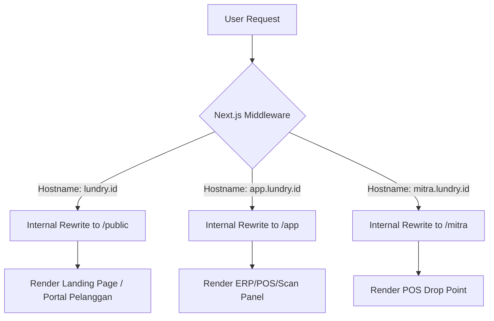
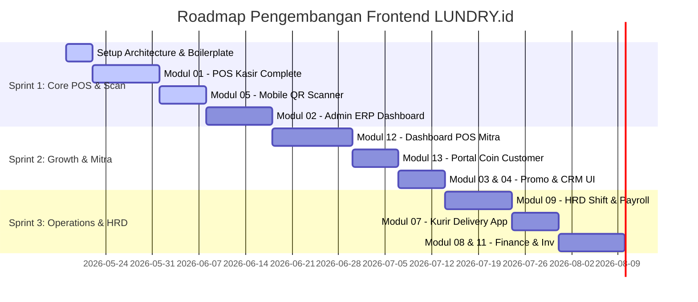

# 🛠️ LUNDRY.id — Frontend Implementation Plan & Technical Architecture
> **Sistem ERP & POS Laundry Terintegrasi**  
> **Peran:** Lead Frontend Developer (Forge / The Beacon)  
> **Status:** Draft Perencanaan Eksekusi · Mei 2026  
> **Tech Stack:** Next.js 14+ (App Router) · Tailwind CSS · TypeScript · Radix UI / shadcn/ui · Zustand · TanStack Query

---

Halo Yudha & tim **The Beacon**! 🚀 Forge di sini. Sebagai dev frontend di tim custom software ciamik ini, saya sudah mempelajari seluruh **LUNDRY.id — Software Requirements Document (SRD)**. 

Sistem ERP & POS Laundry ini sangat solid, modular, dan memiliki potensi bisnis yang luar biasa di Jember. Dari kacamata frontend, proyek ini menantang karena kita harus melayani 3 audiens yang sangat berbeda (`lundry.id` untuk publik, `app.lundry.id` untuk kasir/staf/owner, dan `mitra.lundry.id` untuk Drop Point) namun tetap menjaga visual yang premium, loading speed yang wus-wus, dan kemudahan deployment.

Di bawah ini adalah **perencanaan taktis, arsitektur teknis frontend, dan opini teknis "curang"** agar development frontend kita jadi jauh lebih cepat, hemat biaya, dan minim bug! Let's build something epic!

---

## 1. Arsitektur Frontend & Multi-Subdomain

### 1.1 · Strategi Multi-Subdomain (Next.js Middleware Routing)

> [!IMPORTANT]
> **Rekomendasi Utama Forge:** Jangan buat 3 project Next.js terpisah! Ini akan membuat kita menduplikasi styling (globals.css), konfigurasi Tailwind, API Client, types, dan mempersulit deployment di Cloudflare Pages.
>
> Gunakan **Single Next.js Monorepo** dengan routing berbasis hostname di **Next.js Middleware**. Kita deploy satu project di Cloudflare Pages, dan Cloudflare akan mengarahkan domain `lundry.id`, `app.lundry.id`, dan `mitra.lundry.id` ke project yang sama. Middleware kita yang akan mengatur routing internalnya!

#### Struktur Folder Root (`/src/app`)

Dengan Middleware, kita membagi folder `/src/app` berdasarkan kelompok subdomain menggunakan Next.js Route Groups:

```
src/
├── app/
│   ├── (public)/          # Untuk lundry.id (Landing page & portal user)
│   │   ├── page.tsx
│   │   └── cek-order/
│   ├── (app)/             # Untuk app.lundry.id (Dashboard Admin, ERP, Kasir, Kurir)
│   │   ├── layout.tsx
│   │   ├── kasir/
│   │   ├── scan/
│   │   └── kurir/
│   ├── (mitra)/           # Untuk mitra.lundry.id (POS Drop Point)
│   │   ├── layout.tsx
│   │   └── dashboard/
│   ├── globals.css
│   ├── layout.tsx
│   └── middleware.ts      # Jantung dari subdomain routing!
```

#### Diagram Alur Subdomain Routing



#### Kode Implementasi `src/middleware.ts`
Berikut adalah boilerplate middleware yang akan menangani rewrite subdomain ini dengan aman:

```typescript
// src/middleware.ts
import { NextResponse } from 'next/server';
import type { NextRequest } from 'next/server';

export function middleware(req: NextRequest) {
  const url = req.nextUrl.clone();
  const hostname = req.headers.get('host') || '';

  // Definisikan domain utama dan subdomain
  const isAppSubdomain = hostname.startsWith('app.localhost') || hostname.startsWith('app.lundry.id');
  const isMitraSubdomain = hostname.startsWith('mitra.localhost') || hostname.startsWith('mitra.lundry.id');

  // 1. Routing untuk app.lundry.id (ERP / Kasir / Kurir)
  if (isAppSubdomain) {
    url.pathname = `/(app)${url.pathname}`;
    return NextResponse.rewrite(url);
  }

  // 2. Routing untuk mitra.lundry.id (POS Drop Point)
  if (isMitraSubdomain) {
    url.pathname = `/(mitra)${url.pathname}`;
    return NextResponse.rewrite(url);
  }

  // 3. Routing default untuk lundry.id (Landing Page / Portal Customer)
  url.pathname = `/(public)${url.pathname}`;
  return NextResponse.rewrite(url);
}

export const config = {
  matcher: [
    /*
     * Match all request paths except for the ones starting with:
     * - api (API routes)
     * - _next/static (static files)
     * - _next/image (image optimization files)
     * - favicon.ico (favicon file)
     * - logo.webp, etc (public assets)
     */
    '/((?!api|_next/static|_next/image|favicon.ico|logo.webp|assets|.*\\..*).*)',
  ],
};
```

---

## 2. Tech Stack & State Management

Untuk menghasilkan antarmuka ERP dan POS yang responsif, adaptif, dan super premium, berikut adalah kombinasi stack yang wajib di-install:

### 2.1 · Package & Library Rekomendasi

| Kategori | Library | Alasan & Keuntungan |
|---|---|---|
| **Data Fetching** | `@tanstack/react-query` | Caching otomatis, background re-validation, query retries, dan sinkronisasi mutasi yang sangat clean untuk data transaksi kasir yang dinamis. |
| **State Management** | `zustand` | State management yang super ringan, tanpa boilerplate, sangat cocok untuk keranjang POS Kasir (Modul 01) dan filter dashboard ERP (Modul 02). |
| **Icons** | `lucide-react` | Kumpulan icon modern yang sangat lengkap, konsisten, dan terintegrasi dengan Tailwind. |
| **Charts** | `recharts` / `tremor` | Visualisasi dashboard ERP (omzet, kapasitas mesin, performa drop point) dengan desain estetik, responsif, dan support dark-mode bawaan. |
| **Animations** | `framer-motion` | Micro-animations premium pada dashboard, transisi halaman kasir, dan feedback saat memindai QR Code. |
| **QR Code Scanner** | `html5-qrcode` | Library kamera web paling stabil untuk scan QR label plastik cucian di browser smartphone karyawan/kurir tanpa install aplikasi native. |

### 2.2 · Client State vs Server State
Kita harus memisahkan state dengan bijak:
- **Server State (React Query):** Data transaksi order, daftar mesin, riwayat absensi, data pelanggan, dan data inventori. Ini di-handle oleh React Query dengan `staleTime: 5000` (5 detik) untuk dashboard real-time.
- **Client State (Zustand):** 
  - `useCartStore`: Menyimpan item cucian yang sedang diinput kasir sebelum di-checkout.
  - `useAuthStore`: Menyimpan data profil user yang sedang login dan token JWT sementara.
  - `useUIStore`: Mengatur state sidebar, dark mode, dan active filters global.

---

## 3. Strategi Implementasi Fitur Kunci (Opini Teknis "Curang" Forge)

Bagian ini adalah opini teknis khusus dari saya untuk mempermudah pengerjaan fitur-fitur kompleks yang ada di SRD agar tidak menjadi mimpi buruk saat coding.

### 3.1 · Modul 01: POS Kasir — Input Kilat & Shortcut
Antarmuka kasir harus dirancang untuk **kecepatan**. Kasir tidak boleh terlalu sering memegang mouse.

> [!TIP]
> **Keyboard Shortcuts:** Implementasikan keyboard listeners di Next.js (menggunakan React hook custom `useKeyPress`). 
> - `F1` -> Fokus ke input Cari Pelanggan.
> - `F2` -> Tambah Kiloan Regular.
> - `F3` -> Tambah Kiloan Express.
> - `F9` -> Proses Bayar (buka modal bayar).
> - `Enter` (di dalam modal bayar) -> Konfirmasi Pembayaran & Cetak Nota.

### 3.2 · Modul 01: Cetak Nota Thermal 80mm Tanpa Dialog Print Browser

Secara default, jika kita menekan tombol print di web, browser akan memunculkan dialog cetak PDF bawaan. Ini sangat mengganggu kecepatan transaksi kasir.

#### Solusi Premium Forge (Pilih Salah Satu):
1. **Network Direct Printing (Rekomendasi Utama):**
   Printer thermal di outlet terhubung ke jaringan lokal via LAN/Wi-Fi (memiliki IP address static). Saat kasir klik "Selesai", frontend Next.js mengirimkan request POST ke backend Laravel `/orders/{id}/print`. Laravel (menggunakan package `mike42/escpos-php`) akan langsung mengirimkan raw command ESC/POS ke IP Printer tersebut via socket TCP. **Hasilnya: Printer berbunyi dan mencetak dalam <1 detik, kasir tidak melihat dialog cetak sama sekali di layar!**
2. **WebBluetooth / WebUSB API (Alternatif):**
   Jika printer tersambung via USB ke komputer kasir atau Bluetooth ke tablet kasir. Kita bisa menggunakan WebBluetooth API langsung di frontend Next.js untuk menulis byte ESC/POS langsung to printer.

### 3.3 · Modul 05: Scan QR Code di Browser HP Karyawan/Kurir

Modul 05 mengharuskan karyawan dan kurir melakukan scan QR bag cucian lewat HP mereka. Kita tidak perlu membuat aplikasi Android/iOS native! PWA Next.js sudah lebih dari cukup.

> [!CAUTION]
> Kamera web sering kali lambat fokus atau nge-lag jika menggunakan library yang salah. Gunakan `html5-qrcode` yang memiliki performa decoding sangat cepat dan mendukung auto-focus pada browser Chrome/Safari mobile.

#### Contoh Komponen React Scanner Cepat:
```tsx
// src/components/ui-custom/QRScanner.tsx
import { useEffect, useRef } from 'react';
import { Html5QrcodeScanner } from 'html5-qrcode';

interface QRScannerProps {
  onScanSuccess: (decodedText: string) => void;
  onScanError?: (error: string) => void;
}

export function QRScanner({ onScanSuccess, onScanError }: QRScannerProps) {
  const scannerRef = useRef<Html5QrcodeScanner | null>(null);

  useEffect(() => {
    scannerRef.current = new Html5QrcodeScanner(
      "qr-reader-container",
      { 
        fps: 15, 
        qrbox: { width: 250, height: 250 },
        aspectRatio: 1.0
      },
      /* verbose= */ false
    );

    scannerRef.current.render(
      (decodedText) => {
        // Berikan feedback getar singkat di HP Android
        if (navigator.vibrate) navigator.vibrate(100);
        
        onScanSuccess(decodedText);
      },
      (error) => {
        if (onScanError) onScanError(error);
      }
    );

    return () => {
      if (scannerRef.current) {
        scannerRef.current.clear().catch(err => console.error("Failed to clear scanner", err));
      }
    };
  }, [onScanSuccess, onScanError]);

  return (
    <div className="w-full max-w-md mx-auto p-4 bg-slate-900 rounded-3xl overflow-hidden border border-slate-800 shadow-2xl">
      <div id="qr-reader-container" className="overflow-hidden rounded-2xl" />
      <p className="text-center text-xs text-slate-400 mt-3 animate-pulse">
        Posisikan kode QR bag di dalam kotak pemindai
      </p>
    </div>
  );
}
```

### 3.4 · Offline-Ready & PWA (Progressive Web App)
Kurir saat mengantar pakaian ke pelanggan di Jember mungkin akan masuk ke gang-gang atau area kos yang minim sinyal internet. Begitu juga karyawan di area mesin cuci (basement outlet).

> [!NOTE]
> Kita harus mengintegrasikan `next-pwa` ke dalam konfig Next.js kita agar halaman `/scan` dan `/kurir` dapat diakses secara offline. 
>
> **Strategi Sinkronisasi Offline:** 
> Saat kurir/karyawan melakukan scan offline, data scan (QR, timestamp, status) disimpan sementara di **IndexedDB browser** menggunakan library `localforage`. Begitu browser mendeteksi sinyal kembali online (`navigator.onLine`), frontend otomatis melakukan background sync mengirim data antrian scan tersebut ke backend API Laravel `/v1/qr/scan`.

---

## 4. Rencana Kerja & Prioritas Sprints (Executable Roadmap)

Kita akan membagi pengerjaan frontend `app.lundry.id` dan `mitra.lundry.id` menjadi 3 Sprint utama, selaras dengan prioritas bisnis LUNDRY.id untuk soft launch di Jember.



### SPRINT 1 — Core POS & Scan (Durasi: 4 Minggu)
*Fokus Utama: Sistem dasar jalan dulu, outlet siap menerima cucian perdana.*

1. **Week 1: Setup Foundation & Middleware Subdomain**
   - Inisialisasi struktur route group `(public)`, `(app)`, dan `(mitra)` di Next.js.
   - Deploy boilerplate ke Cloudflare Pages dengan konfigurasi domain alias.
   - Buat Axios/Fetch interceptor untuk manajemen JWT token & auto-refresh session.
2. **Week 2-3: Modul 01 POS Kasir (`app.lundry.id/kasir`)**
   - UI Kasir: Panel kiri keranjang belanja (kiloan/satuan), panel kanan cari pelanggan & item layanan.
   - Modal Pembayaran: Split payment UI, input cash kalkulator kembalian, QRIS dynamic mockup.
   - Integrasi Print Bridge (ESCPOS thermal print trigger).
3. **Week 3: Modul 05 PWA Mobile QR Scanner (`app.lundry.id/scan`)**
   - Optimasi PWA & service worker agar bisa di-install sebagai aplikasi di HP staf.
   - UI Kamera Pemindai (menggunakan `html5-qrcode`).
   - UI QC Checklist (Modul 10.5) dengan touch-friendly checkmarks.
4. **Week 4: Modul 02 Dashboard ERP - Bagian Operasional & Finansial**
   - Grafik omzet harian & status antrian mesin (menggunakan Recharts).
   - Indikator real-time kapasitas cuci outlet.

---

### SPRINT 2 — Growth & Mitra Drop Point (Durasi: 3.5 Minggu)
*Fokus Utama: Membuka keran marketing lewat ekosistem Drop Point, referral, dan koin.*

1. **Week 5-6: Modul 12 Dashboard POS Mitra (`mitra.lundry.id`)**
   - UI Login OTP WhatsApp (Desain premium dengan cooldown timer 60 detik & helper input 6 digit).
   - POS Mitra Drop Point: Input order ringkas, estimasi berat, dan cetak label thermal stiker.
   - Halaman Leaderboard Drop Point (Modul 17.8): Papan peringkat estetik dengan animasi bar naik.
2. **Week 7: Modul 13 Portal Coin & Referral Customer (`lundry.id/portal`)**
   - Integrasi ke landing page yang sudah live.
   - Tampilan saldo Coin LUNDRY, histori FIFO koin hangus, dan referral tree visual.
   - Copy-to-clipboard kode referral dengan visual sharing ke WhatsApp.
3. **Week 8: Modul 03 (Promo) & Modul 04 (CRM) Admin Interface**
   - UI Pembuat Promo: Form penjadwalan happy hours, checkbox hari, status toggle, rules stackable.
   - CRM Dashboard: Segmentasi pelanggan otomatis (Regular, VIP, Risiko Churn) dengan visual list tag.

---

### SPRINT 3 — Operations & HRD (Durasi: 4 Minggu)
*Fokus Utama: Otomasi back-office, kurir, dan transparansi internal.*

1. **Week 9: Modul 09 HRD - Absensi, Shift & Payroll**
   - UI Absensi (`app.lundry.id/absen`): Scan QR statis outlet via HP karyawan + input PIN 6 digit.
   - Drag-and-drop Shift Scheduler: Kalender mingguan untuk membagi shift staf laundry.
   - Payroll Generator UI: Preview komponen gaji pokok, bonus, lembur, potongan telat, dan button "Kirim Slip WA".
2. **Week 10: Modul 07 Dashboard Kurir Mobile (`app.lundry.id/kurir`)**
   - UI Antrian Kurir: Daftar pickup/delivery pagi & sore dengan filter status jalan.
   - Integrasi external-link ke Google Maps untuk navigasi cepat alamat pelanggan.
   - Touch scan QR serah-terima baju kotor/bersih di depan pintu pelanggan.
3. **Week 11-12: Modul 08 (Inventory) & Modul 11 (Finance & Pajak)**
   - UI Stok opname: Mutasi bahan habis pakai dengan visual warning level (aman/kritis).
   - Dashboard Laporan Pajak UMKM (0.5% PPh Final): Generate data siap setor, tombol download PDF/Excel laporan bulanan.
   - Modul 16: Halaman Placeholder Franchise Mode (Roadmap v2.0) sebagai pemanis visual premium.

---

## 5. Visual Premium & Micro-Animations (WOW Factor)

Sesuai dengan guidelines **Web Application Development** kita, LUNDRY.id harus memiliki **visual yang mewah, premium, dan memukau owner maupun pelanggan**. Kita akan menerapkan beberapa standar ini:

1. **Sleek Dark Mode & Neon Accents:**
   Gunakan background gelap (`bg-slate-950`) untuk panel dashboard admin dengan aksen warna neon yang modern (Emerald untuk uang masuk/sukses, Indigo/Cyan untuk mesin aktif, Rose untuk maintenance/kritis).
2. **Glassmorphism Cards:**
   Gunakan card dengan efek kaca transparan (`bg-white/5 backdrop-blur-md border-white/10`) pada halaman login OTP dan dashboard kasir untuk memberikan impresi aplikasi modern bernilai miliaran rupiah.
3. **Micro-Feedback Animasi (Framer Motion):**
   - Saat order berhasil dicetak, buat ikon printer memantul kecil (*bounce*).
   - Saat QR scanner sukses membaca kode bag, buat border scanner berwarna hijau berpendar lembut (*pulse glow*).
   - Transisi antar halaman menggunakan *fade-in-slide* yang mulus agar terasa seperti native app, bukan website lambat.
4. **Vibrant HSL Gradients:**
   Gunakan gradasi dinamis untuk tombol utama, contohnya: `bg-gradient-to-r from-emerald-500 to-teal-600 hover:from-emerald-400 hover:to-teal-500 shadow-emerald-500/20 shadow-lg`.

---

## 6. Penilaian Kesiapan Developer (Rekomendasi Penutup)

Tim The Beacon sudah memiliki landasan landing page yang sangat estetik di `lundry.id` dengan pemilihan font *Plus Jakarta Sans* yang modern. Rencana di atas sangat realistis untuk dieksekusi dengan tim kecil fullstack karena kita **menghemat waktu pengembangan 3x lipat** dengan menyatukan 3 aplikasi dalam satu repo Next.js dan memaksimalkan kekuatan API browser untuk hardware (kamera scanner & offline sync).

Bagaimana menurutmu, Yudha? Apakah strategi monorepo-middleware, direct network printing untuk thermal printer, dan roadmap sprint di atas sudah sesuai dengan kapasitas tim saat ini? Let me know, biar langsung kita gas ke step selanjutnya! 🚀🔥
